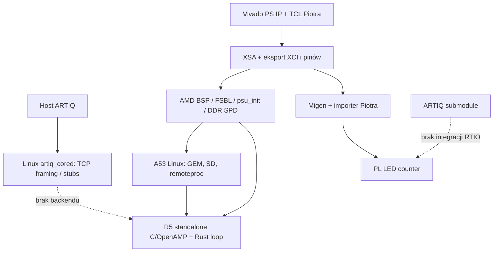
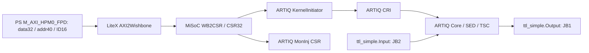

# Archeologia, architektura i decyzje integracyjne

## Co faktycznie zbudował Piotr

`pjedyk/artiq-new` nie jest klonem `artiq-zynq` z podmienionym CPU. Jest
infrastrukturą eksperymentalną Genesys ZU: konfiguracją PS, integracją Vivado
z Migen, połączeniem AMD C BSP z Rust i później ścieżką Linux/OpenAMP/R5.
ARTIQ dołączono jako osobny submodule w końcowej fazie. Własny runtime ARTIQ
nie został zaimplementowany. Nie należy nadpisywać tej pracy nowym SoC.

Historia obejmuje 58 commitów. Pełny indeks: `COMMIT_INDEX.md`; pełne zmiany:
`../evidence/pjedyk-history.patch`. Najważniejsze przejścia:

| Etap | Commity / zakres | Odzyskana wartość / ograniczenie |
|---|---|---|
| Początek i źródła BSP | 6bea584, a6fd1b6, 2e6c062, ea96e08 | Digilent embeddedsw/board files, Nix; nie własny A53 HAL |
| A53 + prosty AXI | ec8c4a9, 4d3eb3c | staticlib Rust wywoływana z C; AXI read 0x80000000; odzyskane XDC i XSA |
| Migen i main | 37d9c14, f3708c1, 08594be, e15b8a2 | LED blinker, bez block design; GP2 wyłączony w późniejszym main; sam staticlib nie jest ELF |
| WIP platform/gateware | 5250db1–0e53dd9 | Eksport XCI/pin properties, automatyczna instancja PS, ręczne parametry Genesys |
| BSP i opis buildu | b3ac6ec–00c2e99 | Kroki GNU make/Vitis/boot; README zawiera transkrypt GDB do rust_main |
| Zmiana A53 -> R5 | 60ffa86, dc841c3 | armv7r-none-eabihf, standalone_r5_0, zarezerwowane DDR dla OpenAMP |
| Linux/Yocto | b226da3–bad204d, 05b4385–8e775b1 | SD/Ethernet config, initramfs, kernel/devicetree, aktualizacje Yocto |
| OpenAMP | 0b5de65–a4e66f9 | rpmsg echo, libmetal, IPI/GIC helper; nie transport kernelów ARTIQ |
| ARTIQ i daemon | 24ef0ce–b25e75b | submodule ARTIQ, porty TCP1380–1383, prototyp framing; kernel wykonanie i mgmt stubs |

W oryginalnym README występuje transkrypt XSDB/GDB z pracującym A53
i wejściem do `rust_main`. Jest to historyczna deklaracja autora, nie
przechowany wynik powtarzalnego testu tego checkoutu. Nie znaleziono raw logs
udowadniających stabilność DDR, Ethernet, RTIO ani eksperyment ARTIQ.
Zachowany `system_wrapper.xsa` ma w środku historyczny `system_wrapper.bit`;
nie jest nowym bitstreamem odtworzonym podczas tej pracy.

Historyczny `simple_axi_slave.v` nie jest pełnym działającym AXI slave:
ARREADY jest stale 1 nawet przy zajętym RVALID, więc master może przekazać
żądania, które giną. BVALID jest kombinacyjne od WVALID i nie zachowuje
odpowiedzi przy backpressure. Odzyskano jego rolę (test read-only), ale nowa
ścieżka używa utrzymywanego mostu, zamiast rozbudowywać ten demonstrator.

## Mapa oryginalnej architektury

Main ma inną ścieżkę: A53 `main()` w C -> staticlib `rust_main()`, po
inicjalizacji runtime przez vendor BSP. Ani main, ani wip nie implementują
własnego AArch64 startup/exception/MMU/cache layer. Starego Cortex-A9 runtime
M-Labs nie wolno traktować jako zgodnego z A53 lub R5 bez adapterów.

Zidentyfikowane elementy PS w wip:

- układ `xczu5ev-sfvc784-1-e`, referencja PS 30 MHz;
- konfiguracja PLL/clocks przez IP i FSBL, PL clock0 i resetn0;
- dynamiczne DDR/SPD; lokalny `xfsbl_ddr_init.c` oparty o vendor C;
- UART0 MIO18–19, 115200; I2C0 MIO22–23, I2C1 MIO8–9;
- QSPI MIO0–6 i SD1 MIO39–51, workaround `disable-wp`;
- GEM0 MIO26–37, MDIO76–77; Linux obsługuje sieć zamiast własnego Rust GEM;
- TTC0 i PL IRQ0 w konfiguracji; R5 OpenAMP używa IPI i XScuGic;
- R5 aplikacja w DDR `0x3ed00000`, długość `0x40000`; regiony shared-memory
  i vring z device tree/OpenAMP muszą być utrzymane spójnie;
- brak działającej ścieżki PS->PL RTIO w oryginalnym aktualnym wip.

DDR należy pozostawić FSBL. Piotr zmodyfikował m.in. obliczenia rank/address
mapping i ścieżkę dynamicznych parametrów. Diff do przypiętego Digilent BSP
i aktualnego AMD zapisano osobno. Nie zamieniono tej wielkiej biblioteki na
Rust Duke. Przed zmianą vendor release trzeba wyizolować minimalny patch
Genesys, zweryfikować SPD, rank count, DQ layout i training na fizycznym DIMM.

## Dodana ścieżka local RTIO

Zachowano platform TCL i importer Piotra, po naprawie kierunku wejść.
Reset PL ma asynchronous assertion i synchronizowane zwolnienie. Wariant
`blinker` pozostaje osobno dostępny; `local-rtio` włącza GP0, wyłącza GP1/GP2
i ustawia żądane 125 MHz. Każdy wariant wymaga osobnego katalogu build.

Porty MAXIGP mają40-bitowe adresy niezależnie od32-bitowych danych;
sprawdzono to w rzeczywistym HWH archiwalnego XSA Piotra. Most zachowuje
pełną szerokość na granicy PS. Obecna ścieżka CSR dekoduje dolne14 bitów
adresu słowa; poza udokumentowanym64 KiB oknem występują aliasy CSR. To
minimalny peripheral path, nie pełny firewall/map decoder SoC. Zweryfikowano
jednosłowowe MMIO; bursts/narrow accesses muszą być dodatkowo sprawdzone
przed zastosowaniem do transferów innych niż CSR.

CSR base `0xA0000000`; banki: initiator0, core1, moninj2, odstęp `0x800`.
Słowa CSR mają32 bity, adresowanie CPU co4 bajty; multiword register ma
najpierw starsze słowo. Adresy powstają z rzeczywistych CSRs w `csr-map.json`.
Nie skopiowano adresów z Kasli ani z historycznego AXI slave0x80000000.

Kanał0 = TTL output JB1/AE13; kanał1 = TTL input JB2/AG14; LVCMOS33.
Przypisania pochodzą z XDC zapisanych przez Piotra w ec8c4a9, dla revC.
Wymagają potwierdzenia rewizji fizycznej płytki. Nie użyto LVDS ani
7-series SERDES. Fine timestamp width0 oznacza8 ns przy rzeczywistym125 MHz.
PLL i rzeczywisty timing wciąż wymagają Vivado i pomiaru. Stała latencja
sieci wyjściowej upstream nie jest tu dowodem fizycznej latencji absolutnej.

DMA/analyzer wymagają dodatkowych PS slave AXI HP/HPC ports, konfiguracji
AFI/CCI i cache ownership. Implementacja Zynq7000 ma inne porty, adresy i
założenia adresowania niż ZynqMP. Nie podłączono jej bez weryfikacji.

## Piotr, Duke i współczesny ekosystem

Duke snapshot `5de7d127` z 2026-08-21 jest nowszy od wip Piotra.
Jego Nix nadal przypina nightly2023 i własny JSON target; data ostatniego
commita nie dowodzi utrzymywanej ścieżki build. Obsługiwany jest ZCU111,
nie Genesys. W kodzie są jawne FIXME dotyczące boot cores2/3, cache/MMU,
ograniczeń buforów Ethernet, SD1.8 V i niekompletnych przypadków DDR.

| Subsystem | Piotr | Duke | Współczesny upstream | Decyzja |
|---|---|---|---|---|
| AArch64 startup | vendor C BSP | własny boot.rs/ASM | AdaCore start.S, stable | AdaCore w diagnostyce; zachować FSBL Piotra |
| exceptions | vendor BSP | exceptions.S, abort.rs | AdaCore vectors, callback symbols | Użyć AdaCore; dodać ESR/FAR debug |
| GIC | XScuGic R5/IPI | własny gic400.rs | arm-gic GicV2 | Użyto arm-gic w teście A53 |
| timer | TTC config, BSP | global.rs, time.rs | aarch64-cpu generic timer | Counter + PPI30 w diagnostyce |
| clocks | TCL/FSBL | ręczny SLCR i PLL | AMD PS/FSBL; LiteX preset/config | Zachować Genesys TCL; nie kopiować PLL ZCU111 |
| UART | vendor UART0 | HAL + baud generator | AdaCore embedded-io | AdaCore po FSBL; baud clock zostaje BSP |
| Ethernet | Linux GEM0 config | Rust GEM/PHY/smoltcp | AMD C GEM; Linux macb | Najpierw Linux/golden link; Rust GEM tylko po potwierdzeniu PHY/cache |
| DDR | AMD/Digilent dynamic SPD | własny DDR/PHY/SPD | utrzymywany AMD C FSBL | Zachować vendor C i board-specific patch Piotra |
| AXI | importer i stary slave | AFI HP/HPC registry | LiteX AXI bridges | Naprawiony importer + LiteX bridge; Duke jako reference AFI |
| cache/MMU | BSP na R5/A53 | własne tablice i maintenance | AdaCore MMU / aarch64-cpu | AdaCore diagnostyka; ARTIQ DMA ownership nadal do integracji |
| SD | vendor BSP/Linux | SDIO/ADMA/FAT | AMD C/Linux | Na bring-up użyć istniejącego boot; nie portować drivera dla sportu |

AdaCore nie zapewnia gotowego Ethernet/DDR/SD/ARTIQ runtime. `ccbrown`
to dodatkowe narzędzia sprzętowe, nie kompletny zamiennik. `cortex-ar`
obejmuje inną rodzinę runtime/architektury; aarch64-cpu zapewnia rejestry
i instrukcje, nie cały BSP. Archiwa i dokładne revisions są w SOURCES.md.

## Zmiany ARTIQ i ryzyko ABI

ARTIQ Piotra to `1461cf909` ze stycznia2026, nie bardzo stary ARTIQ6.
Do obecnego `canonical/master` jest803 commitów. GitHub ARTIQ zakończył
aktualizacje; pobrano rzeczywisty upstream M-Labs. W aktualnym master
kompilator Python zastąpiono NAC3. NAR3 jest nazwą nowszego firmware Zynq,
a nie synonimem NAC3.

Aktualne NAC3 `Isa` obejmuje Host, RiscV32G, RiscV32IMA, CortexA9.
Nie ma gotowego CortexR5 ani AArch64 kernel target. Kompilacja Rust
`aarch64-unknown-none` sama nie rozwiązuje kernel compiler, ELF relocation,
syscall ABI, exception unwind ani RPC. A53 może uruchamiać AArch32, ale
przeniesienie kernelów CortexA9 do AArch32 EL0 wymaga osobnego przejścia
EL/context, mapowania pamięci i sprawdzenia instrukcji/FPU. R5 nie ma NEON;
nie wolno reklamować CortexA9 jako zamiennika ISA R5.

`artiq-zynq` dostarcza prawdziwe runtime management, RPC, networking,
dynamic loader, unwind/ksupport, RTIO/DMA/analyzer/moninj i DRTIO. Piotr
ma tylko Linux TCP framing i OpenAMP echo. Funkcjonalne porównanie:

| Funkcja | Piotr wip | artiq-zynq |
|---|---|---|
| Boot i OS | FSBL/Linux A53 + C/OpenAMP R5 | SZL + bare-metal CortexA9 |
| Network | Linux socket | GEM + smoltcp async |
| Kernel | odbiera ELF, nie ładuje/nie wykonuje | real loader, support library i drugi core/context |
| RPC | brak backendu | serializacja + dispatcher |
| Management | pusty handler | log/config/reboot/firmware management |
| RTIO | brak w bazie; teraz opt-in subsystem | normalne warianty targetów |
| DMA/analyzer | brak | real DDR AXI engines |
| DRTIO | brak | master/satellite/repeater + właściwe PHY |
| Architecture bindings | AMD C BSP + Rust staticlib | libcortex_a9, libboard_zynq, libsupport_zynq |

Gateware local RTIO sprawdzono z obu snapshotów ARTIQ. Pełny rebase firmware
nie został zrobiony ani zadeklarowany. Rozsądny kolejny wybór po PS/DDR
hardware bring-up: zamrozić upstream runtime9 lub10 i określić kernel ISA,
zachować moduły protocol/RTIO z M-Labs oraz ograniczyć nowy kod do CPU/context,
PS HAL i board integration. Migracja całej ścieżki RPC na własny Python daemon
powiela znaczną część istniejącego runtime i nie ma obecnie uzasadnienia.

## LiteX

Aktualny LiteX ma `soc/cores/cpu/zynqmp/core.py`: PS instantiation, presets,
MIO/EMIO, master AXI, interrupt wiring, memory map i integrację libxil.
LiteX Boards ma ZCU102/104/106/216; nie ma targetu Genesys ZU-5EV.
Genesys2 jest inną płytką i nie może zastąpić platformy ZU.

Zastosowano mały wariant integracji: tylko AXI2Wishbone i Wishbone interface
z LiteX. Nie migrowano SoCCore ani CSR ABI ARTIQ. To usuwa konieczność
pisania własnego AXI slave przy zachowaniu konfiguracji PS Piotra.
Pełny LiteX PS replacement można rozważyć po fizycznym porównaniu XSA/clock
configuration z golden Piotra; nie jest warunkiem pierwszego eksperymentu.

## Instrumentacja i DRTIO

Aktualne narzędzia: UART logs, ESR/FAR, ELF entry/segment validator,
CSR map, RTIO status/error registers, counter i MonInj probes. Test DDR
wykonuje clean/invalidate; nie zalicza odczytu z cache jako sukcesu RAM.
ILA/LiteScope nie są wymagane ani włączone. Jeśli AXI nie odpowiada po
syntezie, tymczasowe ILA powinno obserwować AW/AR/W/B/R i reset/clock.

DRTIO pozostaje po local RTIO. Przed wykorzystaniem istniejącego protokołu
ARTIQ trzeba sprawdzić właściwy GTH/GT clocking Genesys, ref clocks,
recovered clock, deterministic latency, training i reset sequence. Nie
przeniesiono prymitywów GTX7series do UltraScale+ bez adaptera. AFCZ nie
został dodany jako target przed zweryfikowaniem platformy laboratoryjnej.
